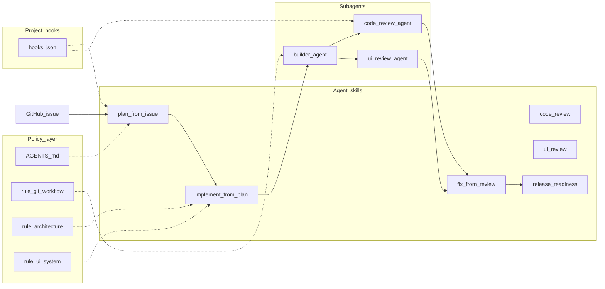

# Cursor operating model — architecture

This document maps the project’s **rules**, **skills**, **subagents**, and **hooks** to each other and to [Cursor](https://cursor.com/docs) concepts. Canonical doc index: [cursor_sources.md](cursor_sources.md). Product intent summary: [cursor-system-overview.md](cursor-system-overview.md).

## Branch policy (strict)

| Rule | Detail |
|------|--------|
| PR base | All **agent-created** pull requests must use **`gh pr create --base dev`** (or equivalent). |
| `main` | **Forbidden** for agent work: no PRs to `main`, no pushes to `main`, no agent-driven merges into `main`. |
| Promotion | **`dev` → `main`** is **human-only**, guided by `/release-readiness` after QA on `dev`. |

Hooks enforce part of this via `beforeShellExecution` (see hook wiring below).

---

## How the pieces fit together

- **AGENTS.md** orchestrates order of operations and points to skills and rules.
- **Rules** constrain architecture, UI, and git/branch behavior.
- **Skills** are explicit procedures (invoked with `/` in Agent when `disable-model-invocation: true`).
- **Subagents** isolate heavy implementation or review passes; review agents emit **`[[BLOCKING]]`** when appropriate.
- **Hooks** implement lightweight automation on Cursor lifecycle events (not a full CI replacement).

---

## Path mapping (overview → repo)

| Overview (logical) | Repo path |
|--------------------|-----------|
| AGENTS.md | [AGENTS.md](../AGENTS.md) |
| rules/ui-system | [.cursor/rules/ui-system.mdc](../.cursor/rules/ui-system.mdc) |
| rules/architecture | [.cursor/rules/architecture.mdc](../.cursor/rules/architecture.mdc) |
| rules/git-workflow | [.cursor/rules/git-workflow.mdc](../.cursor/rules/git-workflow.mdc) |
| skills/* | [.cursor/skills/<name>/SKILL.md](../.cursor/skills/) |
| subagents/* | [.cursor/agents/*.md](../.cursor/agents/) (Cursor canonical location) |
| hooks/* | [.cursor/hooks/*.mjs](../.cursor/hooks/) + [.cursor/hooks.json](../.cursor/hooks.json) |

---

## Hook wiring (conceptual → Cursor event → script)

Official hook reference: [Hooks](https://cursor.com/docs/hooks) (also listed in [cursor_sources.md](cursor_sources.md)).

| Conceptual hook | Cursor `hooks.json` key | Script | Behavior (v1) |
|-----------------|-------------------------|--------|----------------|
| pre-implementation-check | `beforeSubmitPrompt` | [pre-implementation-check.mjs](../.cursor/hooks/pre-implementation-check.mjs) | Fail-open unless `CURSOR_STRICT_PLAN_GATE=1`; then block “implementation-like” prompts without `#issue` or plan marker. |
| post-implementation-check | `afterFileEdit` + `stop` | [after-file-edit-dirty.mjs](../.cursor/hooks/after-file-edit-dirty.mjs), [stop-post-build.mjs](../.cursor/hooks/stop-post-build.mjs) | After `Write` under `src/`, create `.cursor/hooks/.dirty` (gitignored). On agent `stop` + `completed`, run `npm run build` if dirty was set. |
| pr-open-trigger (+ branch policy) | `beforeShellExecution` | [shell-policy.mjs](../.cursor/hooks/shell-policy.mjs) | Deny `gh pr create` without `--base dev` or with `--base main`; deny `git push` touching `main`; allow with reminder to run reviews after valid `gh pr create`. |
| review-gate | `subagentStart` | [subagent-start-review-gate.mjs](../.cursor/hooks/subagent-start-review-gate.mjs) | v1: allow all; logs type/task to stderr. |
| review-fix-loop | `subagentStop` | [subagent-stop-review-loop.mjs](../.cursor/hooks/subagent-stop-review-loop.mjs) | If `summary` contains `[[BLOCKING]]`, emit `followup_message` to continue with `/fix-from-review`. |

**`stop` / `subagentStop` follow-ups** respect per-hook `loop_limit` (see `hooks.json`; default Cursor cap applies).

---

## Out of scope for Cursor hooks

- **GitHub “PR opened” webhooks** and org-level automation are not replaced by project hooks; use **GitHub Actions** or integrations for server-side rules.
- **Team-wide enforcement** may use Cursor **Team Rules** / enterprise features ([Rules](https://cursor.com/docs/rules)) in addition to this repo.

---

## Verification in this repo

- Scripts: [package.json](../package.json) — use **`npm run build`** for app changes until further scripts exist.
